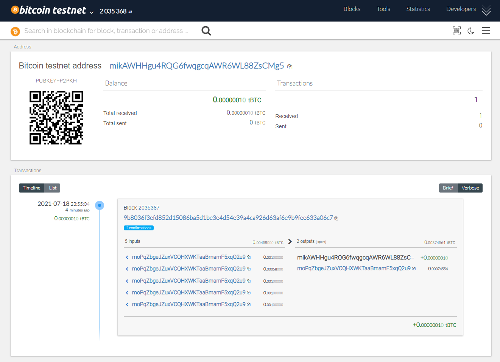
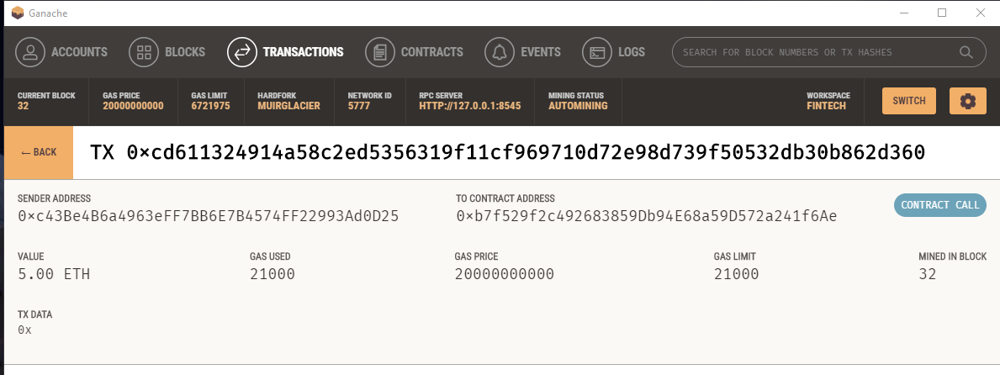

# Multi-Blockchain Wallet in Python


## Background

Your new startup is focusing on building a portfolio management system that supports not only traditional assets
like gold, silver, stocks, etc, but crypto-assets as well! The problem is, there are so many coins out there! It's
a good thing you understand how HD wallets work, since you'll need to build out a system that can create them.

You're in a race to get to the market. There aren't as many tools available in Python for this sort of thing, yet.
Thankfully, you've found a command line tool, `hd-wallet-derive` that supports not only BIP32, BIP39, and BIP44, but
also supports non-standard derivation paths for the most popular wallets out there today! However, you need to integrate
the script into your backend with your dear old friend, Python.

Once you've integrated this "universal" wallet, you can begin to manage billions of addresses across 300+ coins, giving
you a serious edge against the competition.

In this assignment, however, you will only need to get 2 coins working: Ethereum and Bitcoin Testnet.
Ethereum keys are the same format on any network, so the Ethereum keys should work with your custom networks or testnets.

## Requirements
The following is a link to view the version of libraries installed.
[Requirements File](requirements.txt)

## Dependencies

The following dependencies are required for this assignment and were likely already installed as part of your preparation for in-class activities. 

> **Important:** If you have _not_ already installed the dependencies listed below, you may do so by following the instructions found in the following guides:
  > - [HD Wallet Derive Installation Guide](Resources/HD_Wallet_Derive_Install_Guide.md) 
  > - [Blockchain TX Installation Guide](Resources/Blockchain_TX_Install_Guide.md).

**Dependencies List:**
- PHP must be installed on your operating system.

- You will need to clone the [`hd-wallet-derive`](https://github.com/dan-da/hd-wallet-derive) tool.

- [`bit`](https://ofek.github.io/bit/) Python Bitcoin library.

- [`web3.py`](https://github.com/ethereum/web3.py) Python Ethereum library.



```sh
send_tx(BTCTEST, priv_key_to_account(BTCTEST, btctest_prv_key), 'mikAWHHgu4RQG6fwqgcqAWR6WL88ZsCMg5', 0.0000001)
```


```sh
send_tx(ETH, priv_key_to_account(ETH, eth_prv_key), '0xb7f529f2c492683859Db94E68a59D572a241f6Ae', 5000000000000000000)
```

